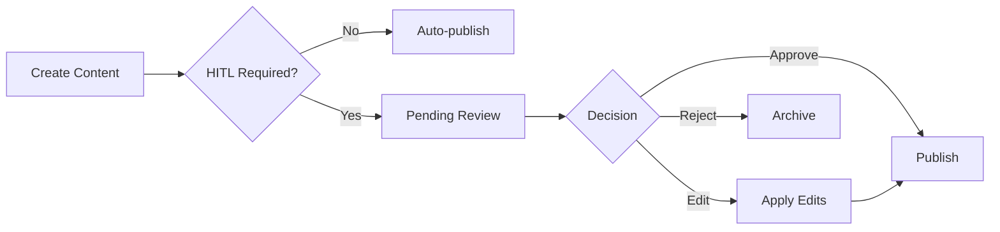

# Content API

The content endpoints handle AI-powered content generation with optional human-in-the-loop (HITL) approval workflows.

## Create Content

Generate text, visual, or combined content using the DYNIQ agent swarm.

```
POST /api/content/create
```

### Request Body

```json
{
  "type": "linkedin_post",
  "topic": "AI agents for Dutch HVAC companies",
  "brand_voice": "everyman_caregiver",
  "platform": "linkedin",
  "language": "nl",
  "include_visual": true
}
```

| Parameter | Type | Required | Description |
|-----------|------|----------|-------------|
| `type` | string | Yes | Content type: `linkedin_post`, `email_sequence`, `blog_post`, `social_media` |
| `topic` | string | Yes | Content topic or brief |
| `brand_voice` | string | No | Brand archetype for tone (default: `everyman_caregiver`) |
| `platform` | string | No | Target platform for format optimization |
| `language` | string | No | Content language (default: `nl`) |
| `include_visual` | bool | No | Generate accompanying visual (default: `false`) |

### Response

```json
{
  "thread_id": "ct-abc123",
  "status": "completed",
  "content": {
    "text": "De eerste installateur die AI omarmt...",
    "hashtags": ["#BuildInPublic", "#AIAgents", "#HVAC"],
    "hook": "22 nodes. 0 zicht. Toen kwamen de agents.",
    "cta": "Wat is jouw grootste frustratie met leads?"
  },
  "metadata": {
    "model": "moonshotai/kimi-k2.5",
    "cost_usd": 0.12,
    "generation_time_seconds": 8.5
  }
}
```

**Rate limit**: 20 requests/minute

## HITL Endpoints

### List Pending Approvals

```
GET /api/hitl/pending
```

Returns all content items awaiting human review.

```json
{
  "pending": [
    {
      "thread_id": "ct-abc123",
      "type": "linkedin_post",
      "created_at": "2026-02-11T10:30:00Z",
      "preview": "De eerste installateur die AI omarmt..."
    }
  ],
  "count": 1
}
```

### Resume with Decision

```
POST /api/hitl/resume
```

### Request Body

```json
{
  "thread_id": "ct-abc123",
  "decision": "approve",
  "edits": null
}
```

| Parameter | Type | Required | Description |
|-----------|------|----------|-------------|
| `thread_id` | string | Yes | Content thread ID |
| `decision` | string | Yes | `approve`, `edit`, `reject` |
| `edits` | object | No | Modified content (required if decision is `edit`) |

### Response

```json
{
  "thread_id": "ct-abc123",
  "status": "approved",
  "published": false,
  "message": "Content approved. Ready for publishing."
}
```

## HITL Flow



:::tip Telegram Integration
HITL approval requests are also sent to Telegram via n8n webhook, enabling mobile review and approval with inline keyboard buttons.
:::
