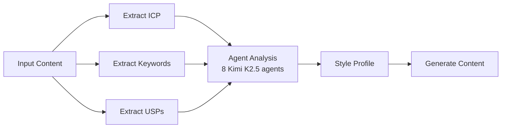

# Style Transfer API

The style transfer pipeline analyzes existing content to extract brand voice characteristics, then generates new content matching that voice. It uses an 8-agent Kimi K2.5 swarm internally.

## Pipeline Overview



## Endpoints

### Analyze Style

Extract brand voice profile from sample content.

```
POST /api/style-transfer/analyze
```

#### Request Body

```json
{
  "content_samples": [
    "Geen tijd om leads op te volgen? Ruben belt ze binnen 5 minuten.",
    "Simpel. Betrouwbaar. Meer klanten."
  ],
  "brand_name": "DYNIQ",
  "industry": "AI sales automation",
  "level": 2
}
```

| Parameter | Type | Required | Description |
|-----------|------|----------|-------------|
| `content_samples` | string[] | Yes | Sample content for analysis (min 2) |
| `brand_name` | string | Yes | Brand name |
| `industry` | string | No | Industry context |
| `level` | int | No | Analysis depth (0-5, default: 2) |

#### Response

```json
{
  "thread_id": "st-abc123",
  "status": "completed",
  "style_profile": {
    "archetype": "60% Everyman + 40% Caregiver",
    "tone": "casual, confident, direct, local",
    "language_ratio": "70% Dutch, 30% English",
    "power_words": ["werkt", "simpel", "helder", "betrouwbaar"],
    "avoid_words": ["magic", "transform", "revolutionary"],
    "sentence_length": "short (8-12 words average)",
    "formality": 0.3
  },
  "icp_profile": {
    "title": "The Busy Installer",
    "age_range": "35-55",
    "industry": "HVAC/plumbing/electrical",
    "region": "Belgium + Netherlands",
    "pain_points": ["No time for follow-up", "Leads going cold", "Manual admin"]
  },
  "keywords": ["leads", "klanten", "automatisch", "simpel"],
  "usps": ["5-minute response time", "Dutch-speaking AI", "No technical setup"],
  "cost_usd": 2.15,
  "agents_used": 8
}
```

### Generate Content

Generate new content matching an extracted style profile.

```
POST /api/style-transfer/generate
```

#### Request Body

```json
{
  "thread_id": "st-abc123",
  "content_type": "linkedin_post",
  "topic": "AI agent ROI for installers",
  "word_count": 200
}
```

### Get Pipeline Status

```
GET /api/style-transfer/status/{thread_id}
```

### List Analyses

```
GET /api/style-transfer/analyses
```

### Get Analysis Detail

```
GET /api/style-transfer/analysis/{thread_id}
```

### Submit Feedback

```
POST /api/style-transfer/feedback
```

```json
{
  "thread_id": "st-abc123",
  "rating": 4,
  "notes": "Tone was good but too many English words"
}
```

### Delete Analysis

```
DELETE /api/style-transfer/analysis/{thread_id}
```

## Timeouts

The style transfer pipeline uses board meeting agents internally, so timeouts scale with level:

| Level | API Timeout | Typical Duration |
|-------|------------|------------------|
| 0-2 | 240s | ~160s |
| 3 | 300s | ~200s |
| 4 | 360s | ~250s |
| 5 | 420s | ~300s |

:::warning Long-Running Requests
Level 2 style transfers (default) take approximately 160 seconds due to the 8-agent Kimi K2.5 swarm. Ensure your HTTP client timeout is set to at least 240 seconds.
:::
