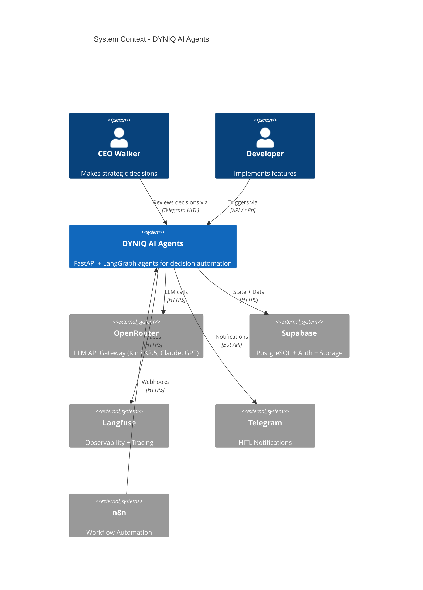
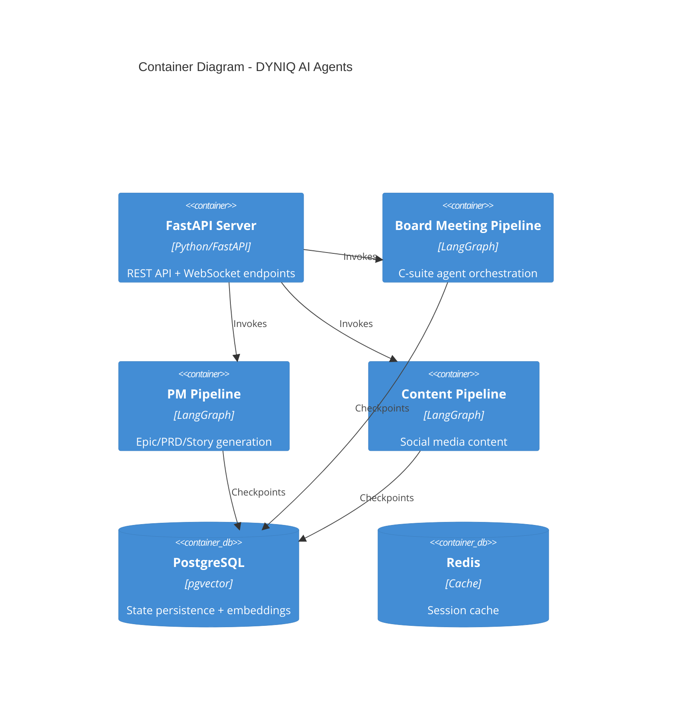
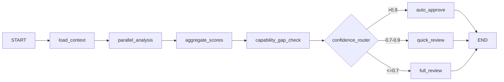
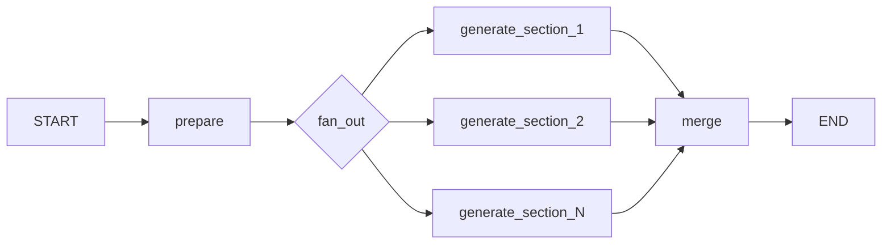
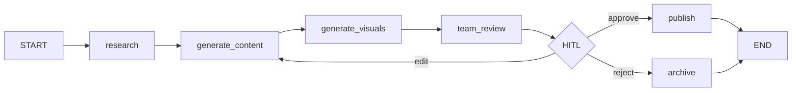
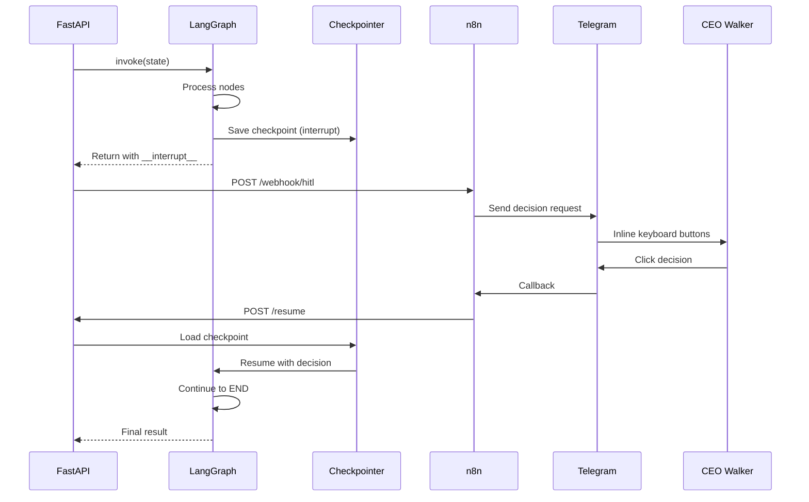
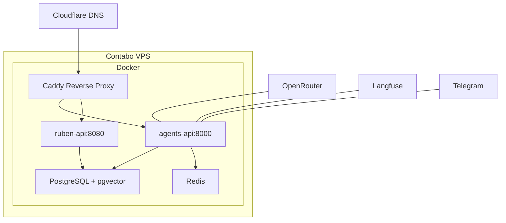

# Agent System Architecture

System architecture for the DYNIQ AI agent platform, including board meeting pipeline, PM pipeline, and content pipeline.

## C4 Context Diagram



## Container Diagram



## Board Meeting Pipeline



| Component | Purpose |
|-----------|---------|
| `load_context` | Fetch historical decisions and R&D research |
| `parallel_analysis` | 6-82 C-suite agents analyze in parallel via Kimi K2.5 |
| `aggregate_scores` | Domain-weighted voting aggregation |
| `capability_gap_check` | Identify missing expertise, spawn specialists |
| `confidence_router` | Route to appropriate HITL level |

## PM Pipeline (Map-Reduce)



Uses LangGraph `Send` API for true parallel section generation:

| Document Type | Sections | Parallelism |
|---------------|----------|-------------|
| Epic | 5 (exec_summary, business_case, pbs, sprint_plan, success) | 5-way |
| PRD | 4 (problem, solution, requirements, acceptance) | 4-way |
| Stories | N stories | N-way |

## Content Pipeline



## HITL Interrupt/Resume Flow



## State Persistence

Uses LangGraph checkpointer for HITL state persistence:

```python
# PostgreSQL (production)
from langgraph.checkpoint.postgres.aio import AsyncPostgresSaver
checkpointer = AsyncPostgresSaver.from_conn_string(postgres_url)

# Memory (development)
from langgraph.checkpoint.memory import MemorySaver
checkpointer = MemorySaver()
```

### Key Database Tables

| Table | Purpose |
|-------|---------|
| `board_meeting_decisions` | Historical decisions for context |
| `execution_learnings` | Episodic memory (learning from executions) |
| `validated_patterns` | Semantic memory (promoted learnings) |
| `content_generations` | Content pipeline outputs |

## Deployment Architecture



| Service | URL |
|---------|-----|
| Agents API | `agents-api.dyniq.ai` |
| Voice API | `ruben-api.dyniq.ai` |
| Langfuse | `langfuse.dyniq.ai` |

## Observability

Langfuse integration tracks all LLM calls, graph execution, and HITL decisions via OpenTelemetry.

| Metric | Target | Alert Threshold |
|--------|--------|-----------------|
| Board Meeting Phase 2 latency | < 5 min | > 10 min |
| Epic generation | < 60s | > 2 min |
| Story generation (5) | < 3 min | > 5 min |
| HITL response time | < 24h | > 48h auto-escalate |

## Performance Optimization

| Strategy | Implementation |
|----------|---------------|
| LangGraph Send API | True parallel node execution |
| Async all the way | No blocking I/O |
| Connection pooling | PostgreSQL, Redis |
| Caching | Historical decisions cached 5 min |

| Operation | Latency | Optimization |
|-----------|---------|--------------|
| LLM call (Kimi K2.5) | 8-15s | Parallel execution |
| Database query | 10-50ms | Connection pooling |
| Embedding generation | 200-500ms | Batch processing |
| Telegram notification | 100-300ms | Async fire-and-forget |
