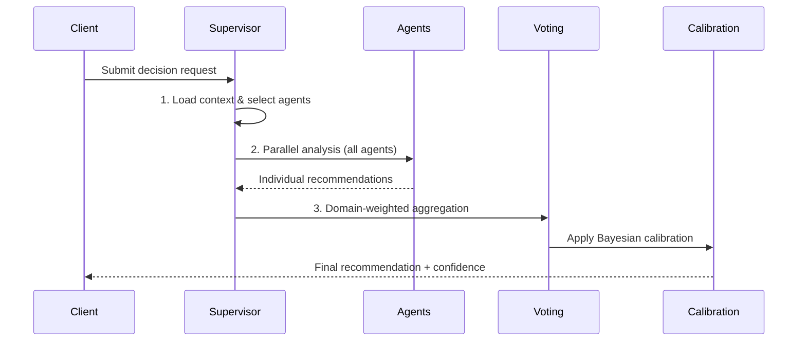
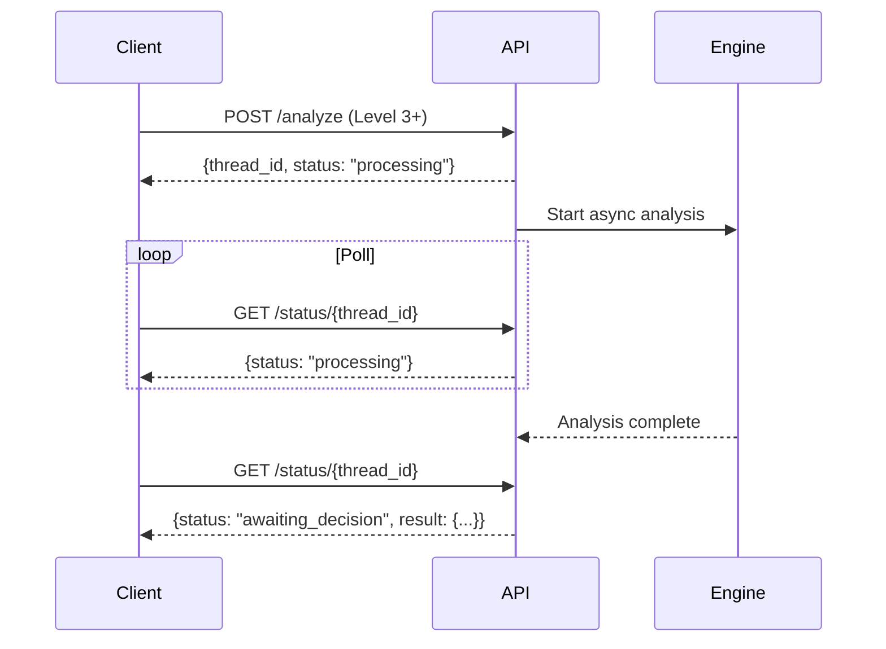

# Board Meeting Architecture

The board meeting engine is DYNIQ's core decision-making system. It orchestrates 3-82 agents through a structured analysis pipeline, producing calibrated recommendations with confidence scores.

## Three-Phase Flow



### Phase 1: Context Loading

The supervisor loads relevant context based on the `decision_type`:

| Decision Type | Context Loaded |
|---------------|----------------|
| `financial` | Budget data, ROI history, Profit First buckets |
| `technical` | Architecture docs, ADRs, tech debt registry |
| `operational` | SOPs, capacity data, sprint velocity |
| `strategic` | Business plan, market data, competitive intel |
| `market` | ICP data, pricing, competitor analysis |

### Phase 2: Parallel Analysis

All selected agents analyze the decision simultaneously. Each agent returns:

- **Recommendation**: `ADOPT`, `DEFER`, `REJECT`, or `INVESTIGATE`
- **Confidence**: 0.0 - 1.0
- **Domain scores**: Per-domain impact ratings
- **Reasoning**: Structured analysis with evidence

### Phase 3: Aggregation & Voting

The voting system uses **domain-weighted scoring**:

```
final_score = sum(agent_weight * domain_relevance * confidence * recommendation_score)
```

#### Domain Weight Matrix

Each agent has expertise weights across domains:

| Agent | Financial | Technical | Operational | Strategic |
|-------|-----------|-----------|-------------|-----------|
| CFO | 0.95 | 0.20 | 0.40 | 0.60 |
| CTO | 0.20 | 0.95 | 0.50 | 0.60 |
| COO | 0.30 | 0.40 | 0.95 | 0.50 |
| CDO | 0.40 | 0.70 | 0.50 | 0.60 |

Specialist agents inherit 80% of their parent tier's weight (`0.8 * parent_weight`).

## Early Termination

To save cost on clear-cut decisions, the engine supports early termination:

| Parameter | Value |
|-----------|-------|
| Confidence threshold | 0.85 |
| Agreement threshold | 0.70 |
| Minimum agents required | 60% of selected |
| Disabled for | Level 4+ (major decisions) |

When early termination triggers, remaining agents are cancelled and the current consensus is returned.

## Bayesian Calibration

Agent confidence scores are calibrated using historical accuracy:

```
calibrated_confidence = prior_accuracy * raw_confidence + (1 - prior_accuracy) * base_rate
```

### Tier Calibration Thresholds

| Tier | ECE Good | ECE Warning | Min Predictions |
|------|----------|-------------|-----------------|
| C-Suite | 0.03 | 0.07 | 10 |
| VP | 0.05 | 0.10 | 10 |
| Director | 0.07 | 0.12 | 10 |
| Industry Advisor | 0.08 | 0.15 | 5 |
| Task Force | 0.10 | 0.20 | 5 |

ECE (Expected Calibration Error) measures the gap between predicted confidence and actual accuracy. Lower is better.

## Async Mode (Level 3+)

Cloudflare enforces a 100-second timeout on proxied requests. For Level 3+ meetings (40+ agents), the engine switches to async mode:



## Decision Lifecycle

1. **Submitted** - Decision request received
2. **Processing** - Agents analyzing in parallel
3. **Awaiting Decision** - Recommendation ready, human review needed
4. **Decided** - Human approved/modified recommendation
5. **Archived** - Stored for calibration training data
