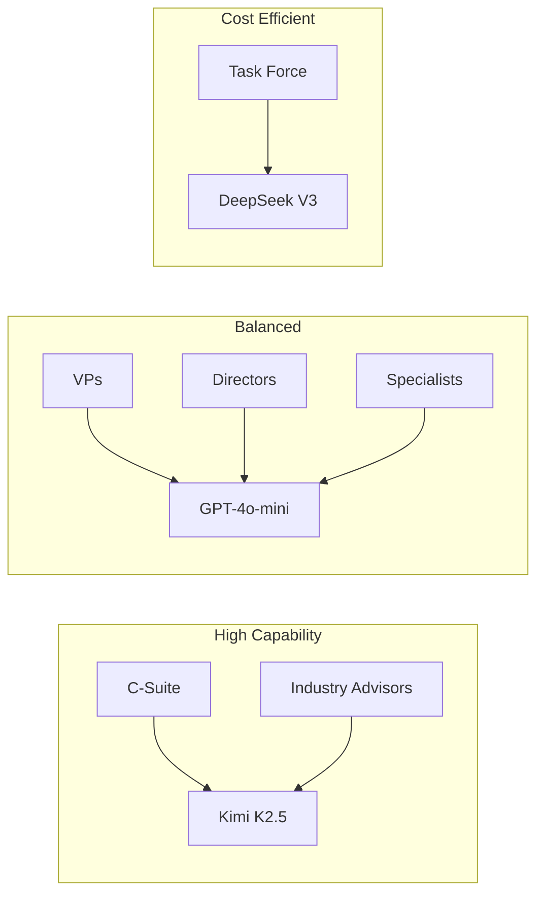

# Model Routing

DYNIQ uses a tier-based model routing system that assigns different LLMs to agents based on their hierarchy level, optimizing the cost-capability tradeoff.

## Tier Model Routing

| Tier | Model | Cost/1M tokens | Rationale |
|------|-------|----------------|-----------|
| C-Suite | Kimi K2.5 | ~$0.60 | Strategic decisions need highest capability |
| VP | GPT-4o-mini | ~$0.15 | Good balance for tactical analysis |
| Director | GPT-4o-mini | ~$0.15 | Implementation planning |
| Industry Advisor | Kimi K2.5 | ~$0.60 | Domain expertise needs nuanced reasoning |
| Specialist | GPT-4o-mini | ~$0.15 | Focused functional analysis |
| Task Force | DeepSeek V3 | ~$0.07 | Dynamic workers, cost-efficient at scale |



## Cost Model

Each meeting level has a cost ceiling based on agent count and model mix:

| Level | C-Suite | VP | Director | IA | Specialist | Task Force | Total Agents | Est. Cost |
|-------|---------|-----|----------|-----|-----------|------------|-------------|-----------|
| 0 | 3 | 0 | 0 | 0 | 0 | 0 | 3 | $0.30 |
| 1 | 8 | 0 | 0 | 0 | 0 | 0 | 8 | $0.80 |
| 2 | 9 | 8 | 0 | 3 | 0 | 0 | 20 | $2.00 |
| 3 | 9 | 16 | 12 | 8 | 5 | 0 | 50 | $4.00 |
| 4 | 9 | 16 | 24 | 15 | 6 | 0 | 70 | $6.00 |
| 5 | 9 | 16 | 24 | 15 | 18 | 8 | 90 | $10.00 |
| 6 | 9 | 16 | 24 | 15 | 18 | 18 | 100 | $12.00 |

## Model Selection Logic

```python
def get_model_for_agent(agent_tier: str) -> str:
    """Select model based on agent tier."""
    TIER_MODEL_ROUTING = {
        "c_suite": "moonshotai/kimi-k2.5",
        "vp": "openai/gpt-4o-mini",
        "director": "openai/gpt-4o-mini",
        "industry_advisor": "moonshotai/kimi-k2.5",
        "specialist": "openai/gpt-4o-mini",
        "task_force": "deepseek/deepseek-chat-v3-0324",
    }
    return TIER_MODEL_ROUTING.get(agent_tier, "openai/gpt-4o-mini")
```

## Cost Tracking

All LLM calls are traced in Langfuse with per-agent cost attribution:

| Attribute | OpenTelemetry Key |
|-----------|-------------------|
| Cost | `gen_ai.usage.cost` |
| Prompt tokens | `gen_ai.usage.prompt_tokens` |
| Completion tokens | `gen_ai.usage.completion_tokens` |
| Model | `gen_ai.response.model` |

:::warning Cost Attribute
Use `gen_ai.usage.cost` (not `gen_ai.usage.cost_usd`). Langfuse only recognizes the former.
:::

## Timeout Configuration

Different tiers have different expected latencies:

| Agent Type | Typical Duration | Timeout Risk |
|------------|------------------|--------------|
| C-Suite (Kimi) | 30-60s | Low |
| VP (GPT-4o-mini) | 15-30s | Low |
| Director (GPT-4o-mini) | 15-30s | Low |
| Industry Advisor (Kimi) | 30-60s | Low-Medium |
| Task Force (DeepSeek) | 10-20s | Low |

For Level 2 meetings (default), 6/8 agent responses is sufficient to proceed. The system does not block on slow agents when consensus is already clear.

## OpenRouter Integration

All LLM calls route through [OpenRouter](https://openrouter.ai/) for unified access to multiple providers:

- Single API key for all models
- Automatic fallback between providers
- Cost tracking per request
- Rate limiting and quota management
