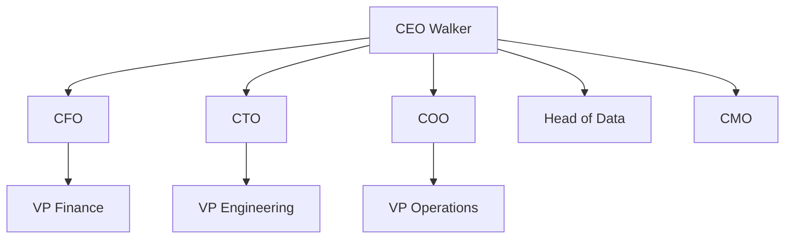

# Architecture Overview

DYNIQ is an AI-native platform built around an **82-agent swarm** organized in a C-Suite hierarchy.

## Agent Hierarchy

## Swarm Tiers

| Tier | Role | Count |
|------|------|-------|
| 1 | C-Suite | 9 |
| 2 | VPs | 16 |
| 3 | Directors | 24 |
| 4 | Industry Advisors | 15 |
| 5 | Specialists | 18 |
| **Total** | | **82** |

## Key Systems

- **Board Meeting Engine** - Multi-agent decision-making with Bayesian calibration
- **Style Transfer Pipeline** - Brand voice analysis and content generation
- **Vision Pipeline** - UI-to-code generation with Kimi K2.5
- **Voice Agent (Ruben)** - LiveKit-powered AI sales calls

:::info Content Coming Soon
Detailed architecture documentation is being migrated from internal references. Check back during Sprint 1 (Feb 12-25, 2026).
:::
