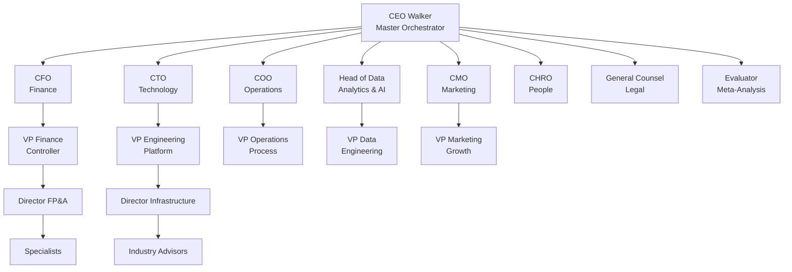

# Architecture Overview

DYNIQ is an AI-native platform built around an **82-agent swarm** organized in a corporate C-Suite hierarchy. Agents collaborate through structured board meetings, producing calibrated decisions with domain-weighted voting.

## Agent Hierarchy

## Swarm Tiers

| Tier | Role | Count | Model | Purpose |
|------|------|-------|-------|---------|
| 1 | C-Suite | 9 | Kimi K2.5 | Strategic decisions, domain leadership |
| 2 | VPs | 16 | GPT-4o-mini | Tactical analysis, team coordination |
| 3 | Directors | 24 | GPT-4o-mini | Implementation planning, execution |
| 4 | Industry Advisors | 15 | Kimi K2.5 | Domain expertise (HVAC, SaaS, etc.) |
| 5 | Specialists | 18 | GPT-4o-mini | Deep functional expertise |
| **Total** | | **82** | | |

:::tip Dynamic Scaling
The Task Force system can dynamically spawn additional agents beyond the 82 static agents using DeepSeek V3 for cost-efficient parallel execution.
:::

## Key Systems

### Board Meeting Engine
Multi-agent decision-making with Bayesian calibration, domain-weighted voting, and early termination. See [Board Meeting Architecture](./board-meeting).

### Model Routing
Tier-based model selection optimizing cost vs. capability. See [Model Routing](./model-routing).

### Style Transfer Pipeline
Brand voice analysis using 8-agent Kimi K2.5 swarm for ICP extraction, keyword analysis, and content generation.

### Vision Pipeline
UI-to-code generation converting screenshots and descriptions into React components using Kimi K2.5 native vision.

### Voice Agent (Ruben)
LiveKit-powered AI sales agent handling inbound/outbound calls with real-time STT (Deepgram), LLM (OpenRouter), and TTS (ElevenLabs).

## Scaling Levels

The platform supports 7 complexity levels that control agent count, cost, and timeout:

| Level | Agents | Est. Cost | Use Case |
|-------|--------|-----------|----------|
| 0 | 3 | $0.30 | Quick single-domain check |
| 1 | 8 | $0.80 | Standard C-Suite review |
| 2 | 20-26 | $2.00 | Full executive analysis |
| 3 | 40-50 | $4.00 | Cross-functional deep dive |
| 4 | 60-70 | $6.00 | Major strategic decisions |
| 5 | 80-90 | $10.00 | Full organization review |
| 6 | 100 | $12.00 | Maximum capacity |
