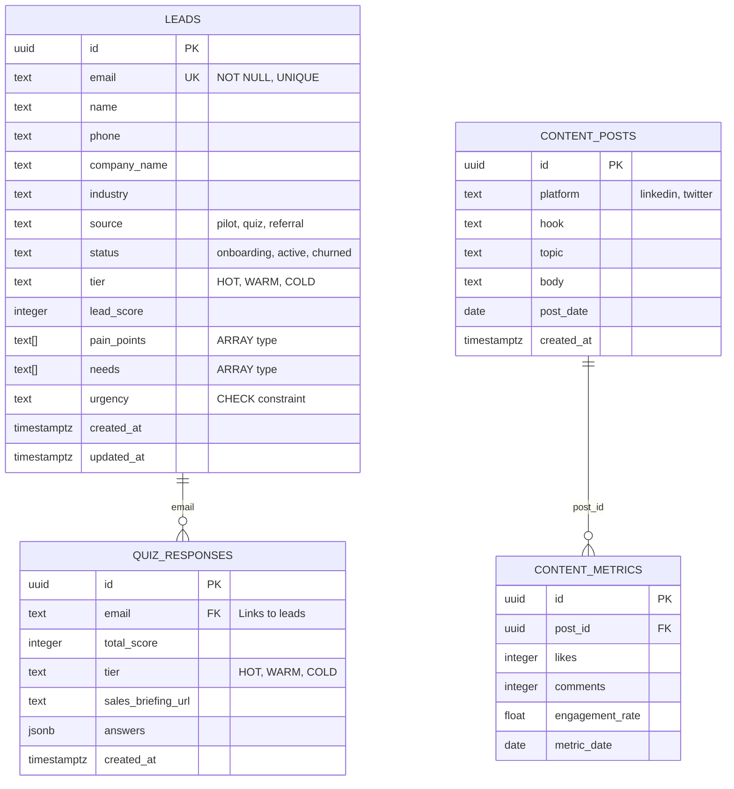
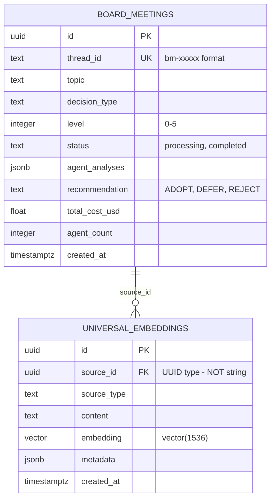
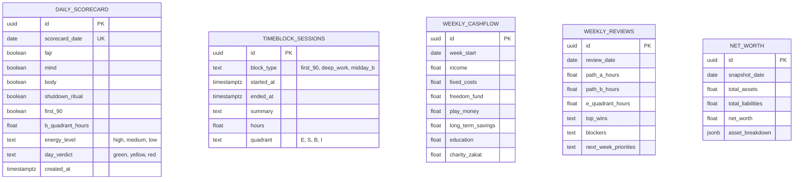
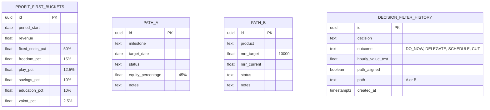
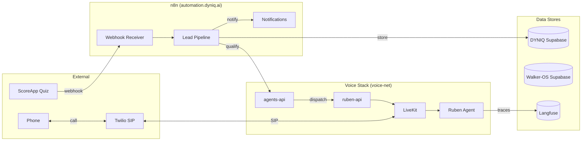

# Data Models

DYNIQ uses two Supabase projects and one Contabo Postgres instance. This page documents all database schemas with ER diagrams.

## Database Overview

| Database | Purpose | Key Tables |
|----------|---------|------------|
| **DYNIQ Supabase** | Business data | leads, quiz_responses, content_posts, board_meetings |
| **Walker-OS Supabase** | Personal data | daily_scorecard, weekly_cashflow, timeblock_sessions |
| **Contabo Postgres** | LiveKit/Langfuse | livekit sessions, langfuse traces |

## DYNIQ Database

### Leads Table (91 columns)

The central table for all lead data. Email is the unique key.



### Key Constraints

| Table | Column | Type | Constraint |
|-------|--------|------|-----------|
| leads | email | text | UNIQUE, NOT NULL |
| leads | urgency | text | CHECK (valid enum) |
| leads | pain_points | text[] | ARRAY - use `'{val1,val2}'` format |
| leads | tier | text | CHECK (HOT/WARM/COLD) |
| quiz_responses | email | text | FK to leads.email |

:::warning Empty Strings
Columns with CHECK constraints reject `""`. Always use `null` instead of empty strings.
:::

### Board Meeting Tables



:::danger UUID Type
`universal_embeddings.source_id` is UUID type. Convert string IDs to UUID5:
```python
import uuid
source_uuid = uuid.uuid5(uuid.NAMESPACE_DNS, thread_id)
```
:::

## Walker-OS Database

### Productivity Tables



### Financial Tables



## Cross-Service Communication



## Schema Discovery

Before proposing new tables, check what exists:

```sql
SELECT table_name,
       (SELECT COUNT(*) FROM information_schema.columns c
        WHERE c.table_name = t.table_name) as columns
FROM information_schema.tables t
WHERE table_schema = 'public'
ORDER BY table_name;
```

Check column types before INSERT:

```sql
SELECT column_name, data_type, is_nullable
FROM information_schema.columns
WHERE table_name = 'your_table_name'
ORDER BY ordinal_position;
```
