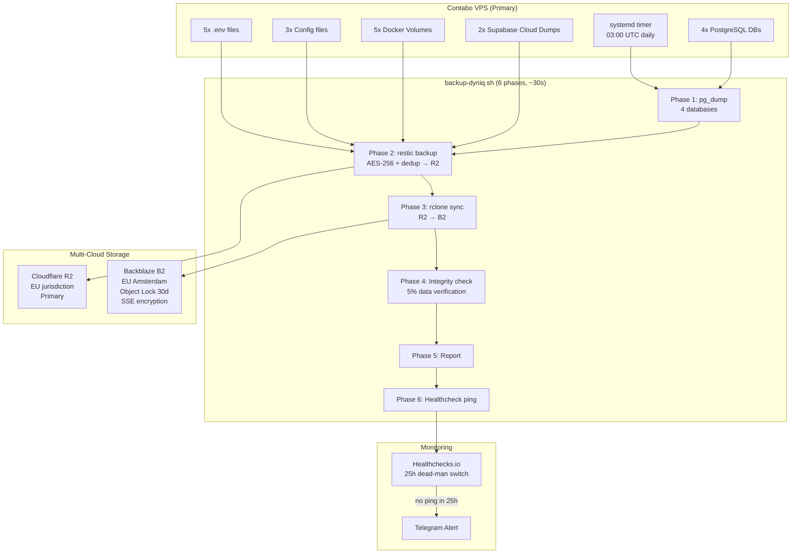

# Backup & Recovery

DYNIQ uses automated, encrypted, multi-cloud backups with ransomware protection and dead-man-switch monitoring.

## Architecture



## What's Backed Up

### On-VPS (daily at 03:00 UTC)

| Category | Items | Size |
|----------|-------|------|
| PostgreSQL dumps | voice, n8n, nocodb, langfuse | ~6 MB |
| Env files | dyniq-voice, n8n, nocodb, langfuse, metabase | <10 KB |
| Configs | Caddyfile, livekit-prod.yaml, sip-config.yaml | <100 KB |
| Docker volumes | ClickHouse, MinIO, Metabase H2, NocoDB, Caddy TLS | ~2 GB |

### Cloud (weekly on Sundays 02:30 UTC)

| Project | Host | Size |
|---------|------|------|
| Walker-OS Supabase | db.uzvknwwrfknsqqacbogn.supabase.co | ~912K |
| DYNIQ Supabase | db.ahseakobsxrtzkikbtxi.supabase.co | ~6.2M |

Supabase dumps land in `/backup/supabase/` and get included in the next daily restic backup.

**Total backup size:** ~1.9 GiB (1.25 GiB stored after deduplication)

## Security Model

### Encryption

| Layer | Type | Managed By |
|-------|------|------------|
| restic | AES-256 client-side encryption | Password in Bitwarden |
| B2 SSE | Server-side encryption at rest | Backblaze (automatic) |
| HTTPS | All transfers encrypted in transit | TLS 1.3 |

### Credential Separation

| Operation | Permissions | Where | Who |
|-----------|------------|-------|-----|
| Daily backup | Write-only (no delete) | VPS systemd | Automated |
| Restore | Read + restic password | Bitwarden | Walker manually |
| Prune | Full access + restic password | Laptop only | Walker monthly |

### Ransomware Protection

- B2 Object Lock: **Compliance mode, 30-day retention** (immutable)
- VPS app keys have **no delete capability**
- Prune only runs from **laptop with admin credentials**
- Even if VPS is fully compromised, backups cannot be deleted for 30 days

## Schedules

| Timer | Schedule | Script |
|-------|----------|--------|
| `dyniq-backup.timer` | Daily 03:00 UTC | `/root/scripts/backup-dyniq.sh` |
| `supabase-dump.timer` | Sundays 02:30 UTC | `/root/scripts/supabase-dump.sh` |

## Monitoring

### Healthchecks.io Dead-Man Switch

- Backup script pings on success
- If no ping received within **25 hours**: Telegram alert to Walker
- Failure ping sent on script error

### Verify Backup Status

```bash
# Timer status
ssh contabo "systemctl status dyniq-backup.timer"

# Latest snapshot
ssh contabo "source /root/.restic-env && restic snapshots --latest 1"

# Last run logs
ssh contabo "journalctl -u dyniq-backup.service --no-pager -n 30"

# Supabase dumps
ssh contabo "ls -lh /backup/supabase/"
```

## Troubleshooting

| Symptom | Cause | Fix |
|---------|-------|-----|
| `Exec format error` (exit 203) | Missing/broken shebang line | `head -1 /root/scripts/backup-dyniq.sh` - must be `#!/bin/bash` |
| Empty SQL dump | PostgreSQL container not running | `docker ps \| grep postgres` |
| `repository is locked` | Stale lock from crashed backup | `restic unlock` |
| restic exit code 3 | Locked files (ClickHouse WAL) | Non-fatal warning, snapshot still saved |
| Phase 3 skipped | B2 remote not configured | Check `rclone listremotes` for `b2-locked:` |
| Supabase dump: version mismatch | pg_dump version < server | Install `postgresql-client-17` |

## Scripts Reference

| Script | Purpose |
|--------|---------|
| `backup-dyniq.sh` | Daily automated backup (6 phases) |
| `supabase-dump.sh` | Weekly Supabase offline dumps |
| `restore-dyniq.sh` | Full disaster recovery restore |
| `update-dns.sh` | Cloudflare DNS failover (8 A records) |
| `bootstrap.sh` | Fresh VPS setup (Docker, restic, rclone) |

All scripts located at `/root/scripts/` on the Contabo VPS.

## Cost

| Component | Monthly Cost |
|-----------|-------------|
| Cloudflare R2 (primary) | ~€0.15 |
| Backblaze B2 (secondary) | ~€0.10 |
| Healthchecks.io | Free tier |
| **Total** | **~€0.25/month** |
