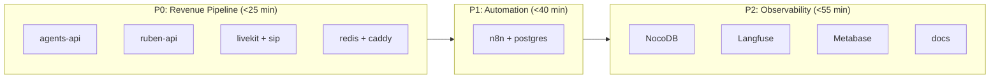
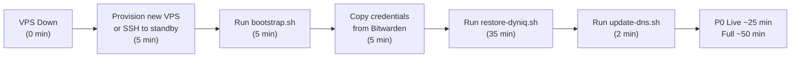

# Disaster Recovery

Recovery procedures for all failure scenarios with defined RTO/RPO targets.

## Recovery Time Objectives

| Scenario | RTO | RPO | Method |
|----------|-----|-----|--------|
| Single DB corruption | **15 min** | 24h | `restic restore` + `psql` |
| Full VPS failure | **50-55 min** | 24h | `restore-dyniq.sh` on new VPS |
| Contabo DC failure | **60-75 min** | 24h | New VPS + DNS failover |
| Cloudflare R2 outage | 60 min | 24h | Restore from B2 instead |

## Restore Priority Order



:::note
Supabase (cloud) is **unaffected** by VPS failure. Lead data, board meetings, and content all survive automatically.
:::

## Recovery Procedures

### Scenario 1: Single Database Corruption

**RTO: 15 minutes**

```bash
# 1. Restore specific dump from latest snapshot
ssh contabo "source /root/.restic-env && \
  restic restore latest --target /tmp/restore --include '/backup/n8n.sql'"

# 2. Restore to PostgreSQL
ssh contabo "docker exec -i n8n-postgres-1 psql -U n8n n8n < /tmp/restore/backup/n8n.sql"

# 3. Cleanup
ssh contabo "rm -rf /tmp/restore"
```

**Available dumps:** `voice.sql`, `n8n.sql`, `nocodb.sql`, `langfuse.sql`

### Scenario 2: Full VPS Failure

**RTO: 50-55 minutes**



**Step-by-step:**

```bash
# 1. Provision new VPS (Hetzner CX22 recommended, EU)
# Or SSH to existing cold standby

# 2. Bootstrap the server
scp /root/scripts/bootstrap.sh user@NEW_IP:/root/
ssh NEW_IP "bash /root/scripts/bootstrap.sh"

# 3. Copy credentials from Bitwarden/laptop
scp ~/.restic-env ~/.restic-pass user@NEW_IP:/root/
scp ~/.config/rclone/rclone.conf user@NEW_IP:/root/.config/rclone/

# 4. Full restore (pulls from R2, restores all DBs and configs)
ssh NEW_IP "/root/scripts/restore-dyniq.sh latest NEW_PUBLIC_IP"

# 5. DNS failover (updates all 8 dyniq.ai A records)
./update-dns.sh NEW_PUBLIC_IP
```

### Scenario 3: R2 Outage (Restore from B2)

```bash
# Sync B2 backup to local restic repo
rclone sync b2-locked:dyniq-backup-sec-locked /tmp/restic-local

# Restore from local repo
RESTIC_REPOSITORY=/tmp/restic-local restic restore latest --target /tmp/restore
```

## What Survives Without Backup

| Survives Automatically | Lost Without Backup |
|----------------------|---------------------|
| Supabase data (2 cloud projects) | n8n workflows + credentials |
| Git repos (GitHub) | Langfuse traces + configs |
| Docker images (GHCR) | NocoDB CRM data |
| Cloudflare DNS config | Metabase dashboards (8 dashboards) |
| External API keys (reconstructible) | Voice postgres (embeddings, history) |
| | All .env files (30+ API keys) |
| | Server configs (Caddyfile, SIP, LiveKit) |

## Monthly Prune Process

:::warning
Prune must ONLY be run from Walker's laptop, NEVER from the VPS. The VPS backup key intentionally lacks delete permissions for ransomware protection.
:::

**When:** First Saturday of each month

```bash
# Set up local restic env
export AWS_ACCESS_KEY_ID="<R2_FULL_ACCESS_KEY>"
export AWS_SECRET_ACCESS_KEY="<R2_FULL_ACCESS_SECRET>"
export RESTIC_REPOSITORY="s3:https://<ACCOUNT_ID>.eu.r2.cloudflarestorage.com/dyniq-backup"
export RESTIC_PASSWORD="<from Bitwarden>"

# Keep last 30 daily, 12 weekly, 6 monthly
restic forget --keep-daily 30 --keep-weekly 12 --keep-monthly 6 --prune

# Verify
restic check
restic stats
```

## Quarterly DR Drill

**When:** First Saturday of March, June, September, December
**Duration:** ~1 hour

### Drill Checklist

- [ ] Verify latest snapshot exists and is <24h old
- [ ] Restore to `/tmp/dr-test/` on VPS
- [ ] Validate all 4 SQL dumps load correctly
- [ ] Validate env files are complete
- [ ] Verify DNS failover script works (dry run)
- [ ] Check B2 secondary is in sync with R2
- [ ] Document any issues found

```bash
# Quick validation
ssh contabo "source /root/.restic-env && \
  restic restore latest --target /tmp/dr-test && \
  for f in /tmp/dr-test/backup/*.sql; do \
    echo \"Checking \$f...\"; \
    head -5 \$f | grep -q 'PostgreSQL database dump' && echo 'OK' || echo 'FAIL'; \
  done && \
  rm -rf /tmp/dr-test"
```

## Credentials

:::danger
Never commit credentials to git. All values are in Bitwarden.
:::

| Credential | Bitwarden Label | Purpose |
|------------|----------------|---------|
| Restic password | DYNIQ Restic Backup Encryption Key | Decrypt all backups |
| R2 API keys | In VPS `/root/.restic-env` | Write to Cloudflare R2 |
| B2 app key | In VPS rclone config | Sync to Backblaze B2 |
| Cloudflare DNS token | CLOUDFLARE_DNS_EDIT_API_KEY | DNS failover |
| Healthchecks.io UUID | In VPS `.restic-env` | Monitoring |
| Supabase DB passwords | In VPS `/root/.pgpass-supabase` | Weekly Supabase dumps |
