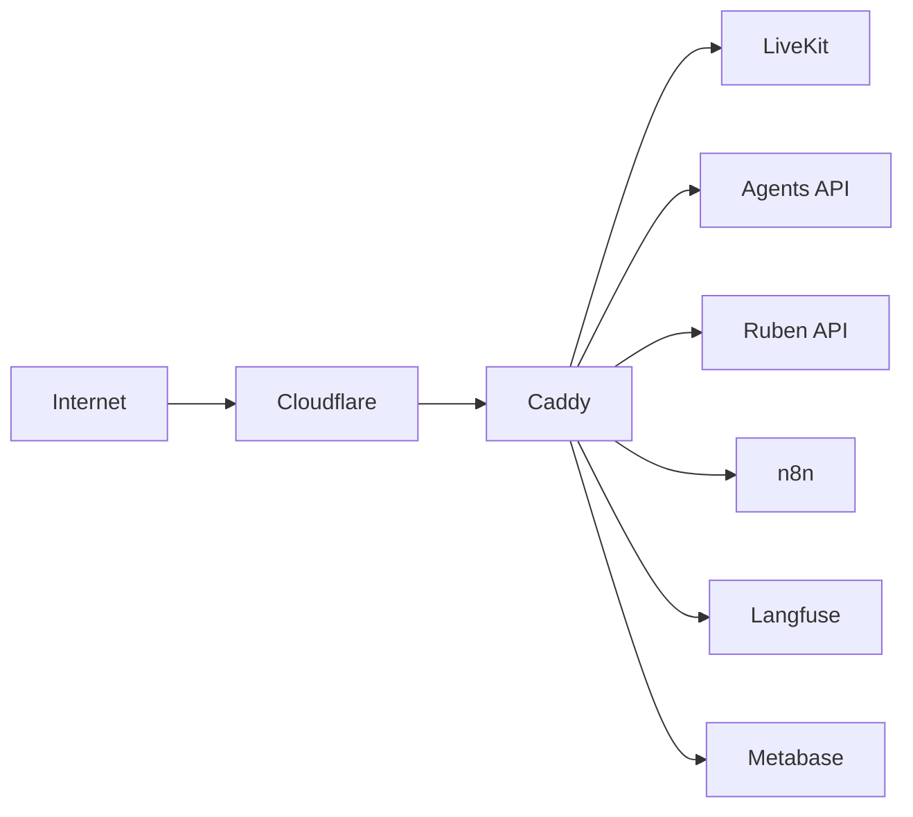

# Infrastructure Overview

DYNIQ runs on a single Contabo VPS with Docker Compose orchestration and Caddy reverse proxy.

## Services

| Domain | Service | Port |
|--------|---------|------|
| voice.dyniq.ai | LiveKit | 7880 |
| ruben-api.dyniq.ai | Ruben Voice API | 8080 |
| agents-api.dyniq.ai | FastAPI Agents | 8000 |
| automation.dyniq.ai | n8n | 5678 |
| langfuse.dyniq.ai | Langfuse | 3100 |
| analytics.dyniq.ai | Metabase | 3001 |

## Architecture

:::info Content Coming Soon
Detailed deployment guides and runbooks are being migrated from internal references.
:::
