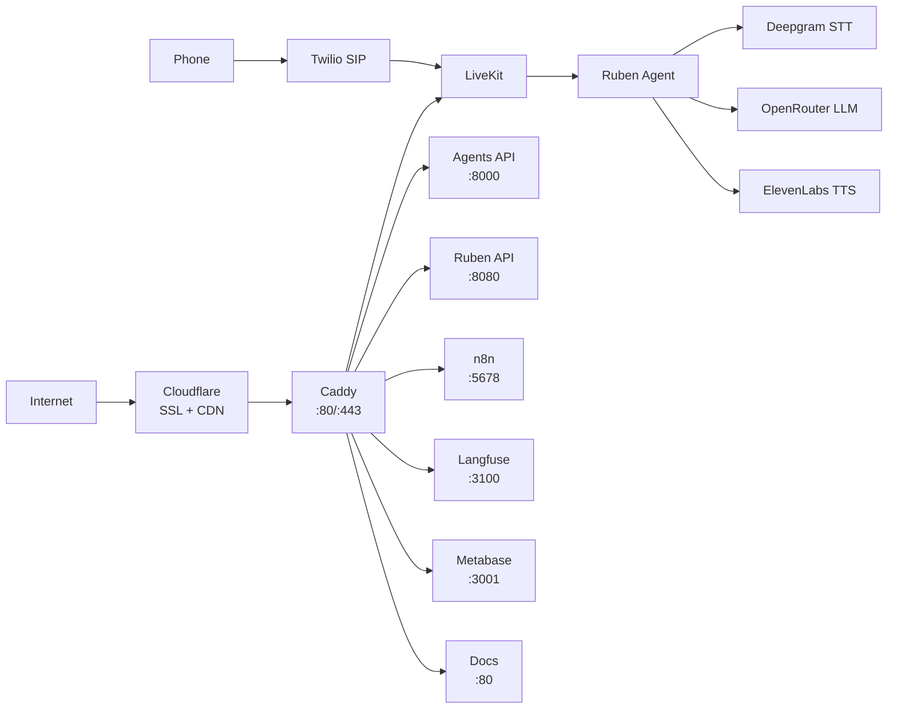
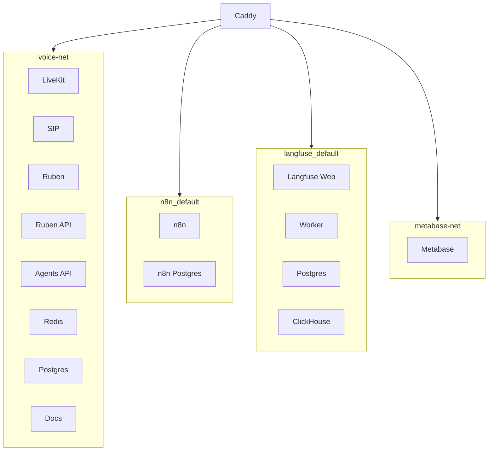

# Infrastructure Overview

DYNIQ runs on a single Contabo VPS with Docker Compose orchestration, Caddy reverse proxy, and Cloudflare for SSL and CDN.

## Architecture

## Services

| Domain | Service | Port | Network | Stack |
|--------|---------|------|---------|-------|
| voice.dyniq.ai | LiveKit | 7880 | voice-net | dyniq-voice |
| ruben-api.dyniq.ai | Ruben Voice API | 8080 | voice-net | dyniq-voice |
| agents-api.dyniq.ai | FastAPI Agents | 8000 | voice-net | dyniq-voice |
| docs.dyniq.ai | Docusaurus (nginx) | 80 | voice-net | dyniq-voice |
| automation.dyniq.ai | n8n | 5678 | n8n_default | n8n |
| crm.dyniq.ai | NocoDB | 8080 | nocodb_default | nocodb |
| langfuse.dyniq.ai | Langfuse | 3100 | langfuse_default | langfuse |
| analytics.dyniq.ai | Metabase | 3001 | metabase-net | metabase |

## Docker Networks

Services are isolated into separate Docker networks. Caddy must be connected to **all** networks to proxy traffic:

## External Services

| Service | Purpose | Integration |
|---------|---------|-------------|
| Cloudflare | SSL termination, CDN, DNS | Proxy all domains |
| Supabase (Walker-OS) | Personal data (scorecards, timeblocks) | REST API |
| Supabase (DYNIQ) | Business data (leads, content, board meetings) | REST API |
| OpenRouter | LLM API gateway | All agent calls |
| ElevenLabs | Text-to-Speech | Ruben voice agent |
| Deepgram | Speech-to-Text | Ruben voice agent |
| Twilio | SIP trunking | Inbound/outbound calls |
| Langfuse | LLM observability | OpenTelemetry traces |

## Port Assignments

| Port Range | Service | Exposure |
|------------|---------|----------|
| 80/443 | Caddy HTTP/HTTPS | Public |
| 5060 | SIP | Public |
| 7880-7882 | LiveKit WS/RTC/TURN | Public |
| 8000 | Agents API | Caddy only |
| 8080 | Ruben API / NocoDB | Caddy only |
| 5678 | n8n | Caddy only |
| 10000-10100 | SIP RTP | Public |
| 50000-50100 | WebRTC Media | Public |

## Cloudflare Configuration

All DYNIQ domains are proxied through Cloudflare with:

- **SSL mode**: Full (strict)
- **Proxy timeout**: 100 seconds (important for board meetings)
- **Caching**: Disabled for API endpoints, enabled for static assets

:::warning Cloudflare 100s Timeout
Cloudflare enforces a hard 100-second timeout on proxied requests. Board meetings at Level 3+ (40+ agents) exceed this limit, which is why they use async polling mode.
:::
