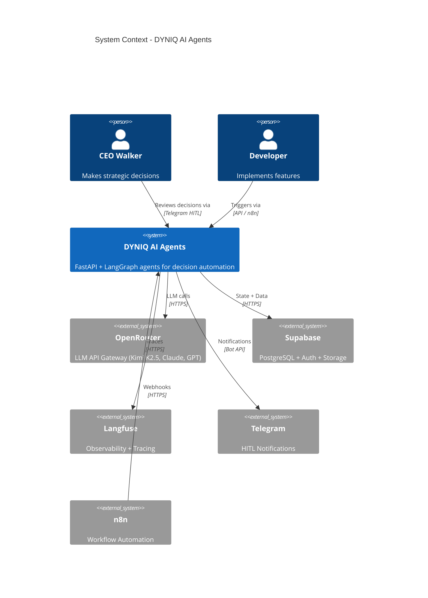
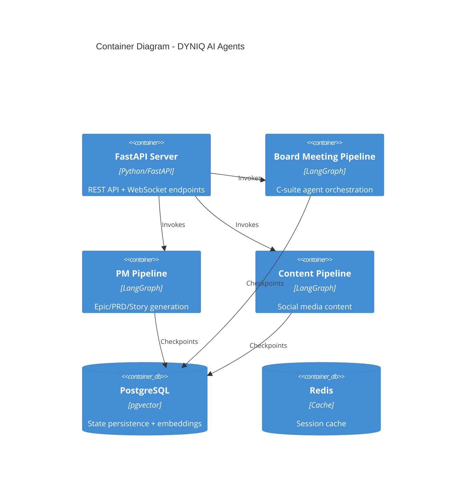
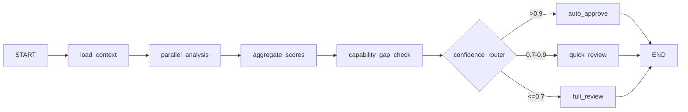
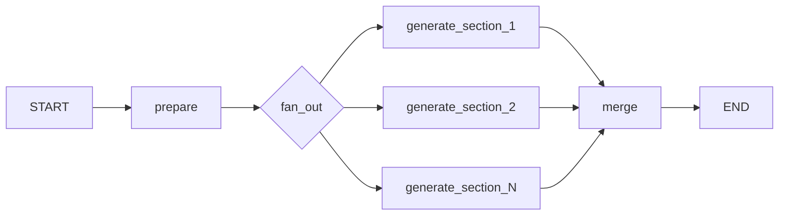
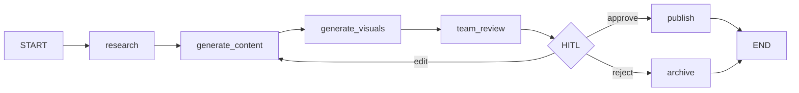
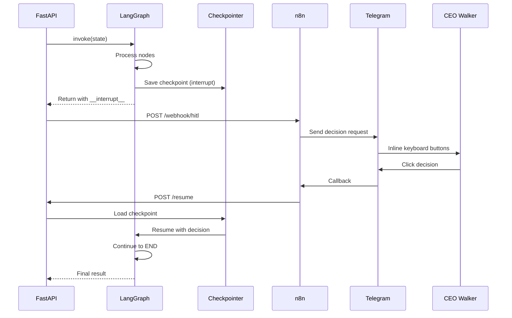
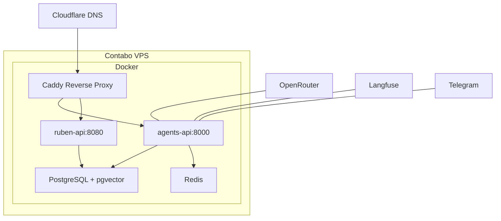

# DYNIQ AI Agents Architecture

System architecture for the DYNIQ AI agent platform.

## C4 Context Diagram



## Container Diagram



## Component Overview

### Board Meeting Pipeline



**Key Components:**

| Component | Purpose |
|-----------|---------|
| `load_context` | Fetch historical decisions, R&D research |
| `parallel_analysis` | 6 C-suite agents analyze in parallel via Kimi K2.5 |
| `aggregate_scores` | Domain-weighted voting aggregation |
| `capability_gap_check` | Identify missing expertise, spawn specialists |
| `confidence_router` | Route to appropriate HITL level |
| `auto/quick/full_review` | HITL interrupt nodes with timeout handling |

### PM Pipeline



**Map-Reduce Pattern:**

Uses LangGraph `Send` API for true parallel execution:

```python
def fan_out_sections(state) -> list[Send]:
    return [
        Send("generate_section", {"section": s, "context": state.context})
        for s in sections
    ]
```

**Document Types:**

| Type | Sections | Parallelism |
|------|----------|-------------|
| Epic | 5 (exec_summary, business_case, pbs, sprint_plan, success) | 5-way |
| PRD | 4 (problem, solution, requirements, acceptance) | 4-way |
| Stories | N stories | N-way |

### Content Pipeline



## Data Flow

### Board Meeting Flow

```
1. API Request → /api/board-meeting/analyze
2. load_context → Fetch from Supabase (historical_decisions, rd_research)
3. parallel_analysis → 6 concurrent Kimi K2.5 calls via OpenRouter
4. aggregate_scores → Domain-weighted voting calculation
5. capability_gap_check → Spawn specialists if needed
6. confidence_router → Route based on score
7. HITL interrupt → Telegram notification via n8n
8. Resume → /api/board-meeting/resume with decision
9. Persist → Store decision in Supabase
```

### HITL Interrupt/Resume



## State Persistence

### Checkpointing

Uses LangGraph checkpointer for HITL state persistence:

```python
# PostgreSQL (production)
from langgraph.checkpoint.postgres.aio import AsyncPostgresSaver
checkpointer = AsyncPostgresSaver.from_conn_string(postgres_url)

# Memory (development)
from langgraph.checkpoint.memory import MemorySaver
checkpointer = MemorySaver()
```

### Database Tables

| Table | Purpose |
|-------|---------|
| `board_meeting_decisions` | Historical decisions for context |
| `execution_learnings` | Episodic memory (learning from executions) |
| `validated_patterns` | Semantic memory (promoted learnings) |
| `content_generations` | Content pipeline outputs |

## Observability

### Langfuse Integration

```python
from langfuse import Langfuse

langfuse = Langfuse(
    public_key=os.getenv("LANGFUSE_PUBLIC_KEY"),
    secret_key=os.getenv("LANGFUSE_SECRET_KEY"),
    host=os.getenv("LANGFUSE_HOST", "https://cloud.langfuse.com")
)

# Traces automatically capture:
# - LLM calls (tokens, latency, cost)
# - Graph node execution
# - HITL decisions
```

### Metrics Tracked

| Metric | Target | Alert Threshold |
|--------|--------|-----------------|
| Phase 2 latency | <5 min | >10 min |
| Epic generation | <60s | >2 min |
| Story generation (5) | <3 min | >5 min |
| HITL response time | <24h | >48h auto-escalate |

## Deployment Architecture



**Production URLs:**

| Service | URL |
|---------|-----|
| Agents API | `agents-api.dyniq.ai` |
| Voice API | `ruben-api.dyniq.ai` |
| Langfuse | `langfuse.dyniq.ai` |

## Security

### Authentication

```python
# API Key authentication
@app.middleware("http")
async def auth_middleware(request: Request, call_next):
    if request.url.path.startswith("/api/"):
        api_key = request.headers.get("X-API-Key")
        if api_key != os.getenv("AGENTS_API_KEY"):
            return JSONResponse(status_code=401, content={"error": "Unauthorized"})
    return await call_next(request)
```

### Secrets Management

- All secrets via environment variables
- Never logged or traced
- Rotated quarterly

## Performance Optimization

### Parallelization Strategies

1. **LangGraph Send API** - True parallel node execution
2. **Async all the way** - No blocking I/O
3. **Connection pooling** - PostgreSQL, Redis
4. **Caching** - Historical decisions cached 5 min

### Bottleneck Analysis

| Operation | Latency | Optimization |
|-----------|---------|--------------|
| LLM call (Kimi K2.5) | 8-15s | Parallel execution |
| Database query | 10-50ms | Connection pooling |
| Embedding generation | 200-500ms | Batch processing |
| Telegram notification | 100-300ms | Async fire-and-forget |

---

*Sprint S6 - Agent Infrastructure v3.1*
