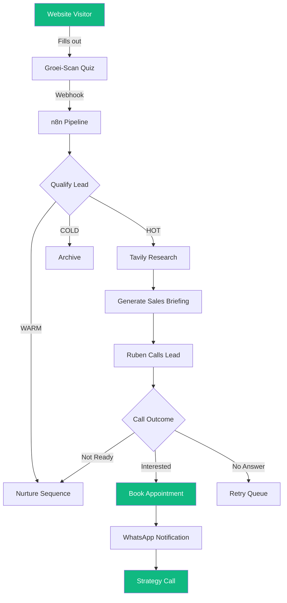

# Getting Started with DYNIQ

Welcome to DYNIQ - the AI-native platform for automated lead qualification and sales.

## What is DYNIQ?

DYNIQ provides:

- **Ruben** - An AI voice agent that calls and qualifies leads
- **82-Agent Board Meeting** - Multi-agent decision-making for strategic analysis
- **Style Transfer** - Brand voice extraction and content generation
- **Workflow Automation** - n8n-powered lead processing pipelines

## Quick Start

### 1. Get your API Key

Contact the DYNIQ team to receive your `X-API-Key` for the Agents API.

### 2. Test the Connection

```bash
curl https://agents-api.dyniq.ai/health \
  -H "X-API-Key: your-api-key"
```

### 3. Run Your First Board Meeting

```bash
curl -X POST https://agents-api.dyniq.ai/api/board-meeting/analyze \
  -H "X-API-Key: your-api-key" \
  -H "Content-Type: application/json" \
  -d '{
    "question": "Should we expand to the German market?",
    "context": "Current revenue: EUR 50k MRR, 80% from Belgium",
    "decision_type": "strategic",
    "level": 2
  }'
```

## Lead Funnel Flow

The complete lead journey from quiz to booked appointment:



## Next Steps

- [Internal Integration Guide](/docs/guides/integration/internal-setup) - API access, webhooks, environment setup
- [Board Meeting Guide](/docs/guides/board-meeting) - Run multi-agent strategic decisions
- [API Reference](/docs/developers/api/overview) - Full endpoint documentation
- [Architecture Overview](/docs/developers/architecture/overview) - System design and agent hierarchy
